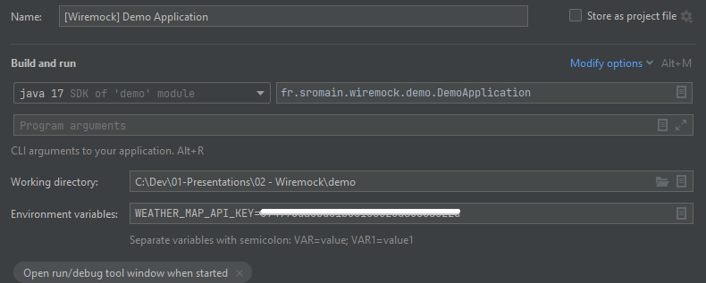

# Wiremock Demo

## ## 0 : Initial Commit

### Feature

Project initialisation with [Spring Initiliazer](https://start.spring.io/)

#### Configuration

- Project : **Maven**
- Language : **Java**
- Spring Boot : **2.7.8**
- Java : **17**

#### Dependencies

- **Spring Web**
- **Spring Data JPA**
- **H2 Database**

## ## 1 : Add Players ressource

### Feature

- Populate h2 database with fake players
- Add endpoint `/players`

## ## 2 : Add Integration Test with MockMvc

### Feature

- Add integration test for endpoint /players

## ## 3 : Add Locations ressource with OpenWeatherMap data

### Feature

- Add dependancy for WebClient
- Add consumer service for OpenWeatherMap API
- Add location service
- Add endpoint `/locations`
- Add test properties file
- Add integration test for endpoint `/locations`

### Configuration

Set **WEATHER_MAP_API_KEY** as environment variable to lauch application.

See [OpenWeather API - Current weather data page](https://openweathermap.org/current).

## ## 4 : Mock OpenWeatherMap API for Integration Tests

- Add dependancy and test configuration for WireMock
- Mock OpenWeatherMap API in endpoint `/locations` integration test
